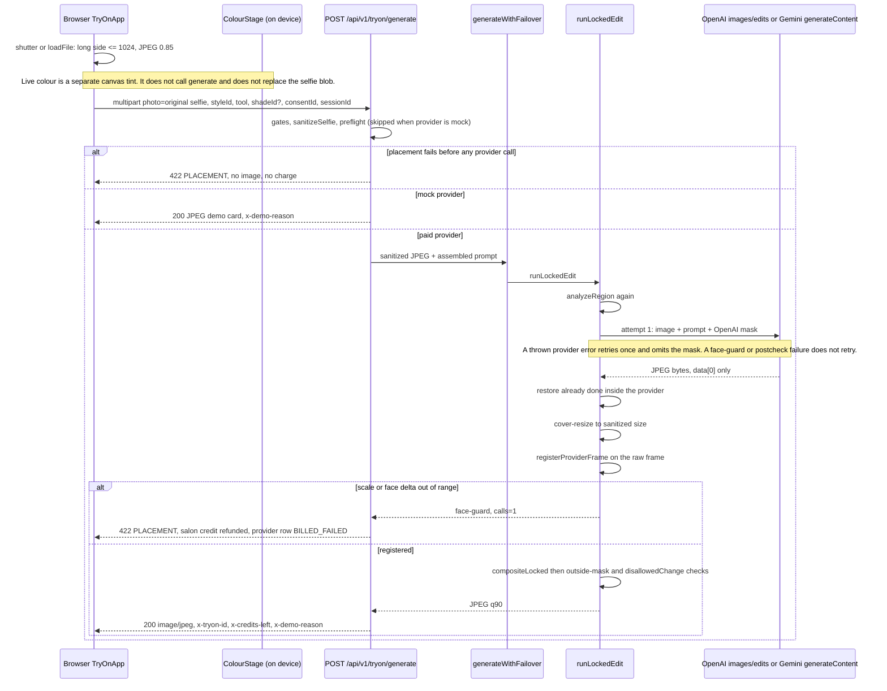

# Hair try-on architecture audit

Inspection only. This file is the only change. No application code was edited, no dependencies were installed, and no paid image-generation request was made.

**Code read:** `cursor/feat-initial-build-5096` at `05f78ce` (`fix: reject a reframed hair edit before compositing`). Line numbers below are from that tree.

**Prior review:** an internal note written against the same commit was checked against the source. Where it disagrees with the checkout, this report says so. Its rupee figures for the two paid tests are cited as that reviewer's usage-record measurements. The `hairtest/` and `hairtest2/` directories are not in the git tree, so those invoices were not re-opened here.

**Reproduced offline on the saved JPEGs** (no network): `npx tsx scripts/replay-raw.ts tests/fixtures/replay/long-layers-raw.jpg tests/fixtures/replay/long-layers-before.jpg long-layers` exits 2 with `face-guard`, one call, and no result image. Detail: `scale 1.793 (h 1.385 w 1.793) offset 0.046,-0.034 faceDelta 33.9 out of range`. A separate local measurement of `hairMask` on the same before image is in section 4.

**Product goal (target, not a claim that the app already does this):** a person captures a front-camera photo or uploads a selfie, selects a hairstyle, and receives a realistic transformed photo. The same person, facial features, expression, skin tone, pose, clothing, lighting, and background should stay. Hair should fit the head. A shorter style should reconstruct skin, ears, and background that the old hair was covering.

**Public reference, not a specification to copy:** the public page at `https://tjhbagalur.com/try-on` is described, from the product brief, as two client paths. Live colour uses MediaPipe hair segmentation and canvas blending. A hairstyle preview sends the whole prepared selfie plus a hairstyle id to a server function and shows the returned complete image in a before/after slider. That client request is described as containing no hair mask and no cut-out hairstyle image. The private server model, prompt, reference handling, and masking strategy are unknown. This audit does not infer them.

---

## 1. Current architecture



### Execution path

Implemented means the function runs on a guest Generate click. Placeholder, dead, and mock are called out.

| Step | What runs | Evidence |
|---|---|---|
| Camera | `startCamera` requests `getUserMedia` with `facingMode: { ideal: nextFacing }` and ideal 720×1280. Nails start on `environment`; hair starts on `user`. | `src/components/tryon/TryOnApp.tsx` `startCamera` lines 214–246; shutter button line 518 |
| Preview mirror | The `<video>` gets CSS `scaleX(-1)` when `facing === "user"`. That transform is display-only. | `TryOnApp.tsx` lines 486–493 |
| Shutter encode | `shutter` scales the long side to at most 1024 and encodes JPEG quality 0.85. When `facing === "user"` it also `translate` + `scale(-1, 1)` before `drawImage`. Upload does not flip. | `shutter` lines 300–321; `loadFile` lines 285–298 |
| Stored selfie | `applyBlob` keeps that JPEG as `faceShot`. Later Generate clicks send `shot.blob`, the original capture, not a previous after image. | `applyBlob` lines 263–283; `preview` lines 323–351 |
| Live colour | Separate. `ColourStage` loads `@mediapipe/tasks-vision`, wasm from `/mediapipe/wasm`, model from `/mediapipe/hair_segmenter.tflite`. `paintMask` tints confidence above 0.2. Canvas ops: `color` 0.85, `soft-light` 0.55, `screen` by shade lift. No server call. If load fails, `onStatus("error")` and `TryOnApp` unmounts the stage. | `src/components/tryon/ColourStage.tsx` lines 13–31, 53–93, 105–122; mount `TryOnApp.tsx` lines 496–506 |
| Segmenter file | `public/mediapipe/NOTICE.md` documents `hair_segmenter.tflite`. The file is not in this checkout. Only `NOTICE.md` and two wasm JS files are under `public/mediapipe/`. Live colour cannot load the segmenter from this tree. Whether a deploy adds the file outside git is unknown. | glob of `public/mediapipe/**` |
| Style click | Style, brow, beard, and nail buttons call `preview(...)`. They are not disabled while `busy` is true. The busy overlay covers the photo frame only (`z-20` inside the frame). | buttons `TryOnApp.tsx` lines 596, 626, 637, 648; overlay lines 526–536 |
| Request body | `FormData`: `photo` (`selfie.jpg`), `slug`, `styleId`, `tool`, `quality=standard` (the route never reads this field), `consentId`, `sessionId`, optional `shadeId` and `salonToken`. `POST /api/v1/tryon/generate`. | `preview` lines 342–352 |
| Route | `POST` in `src/app/api/v1/tryon/generate/route.ts`. `runtime = "nodejs"`, `maxDuration = 60` (lines 29–31). Order: form, 2 MB, tenant, consent within 24h, IP hour/day and tenant minute limits, salon daily cap, tool and style enabled, personal cap, `sanitizeSelfie`, nails face-reject, region, preflight when the provider is not mock, credit reserve, prompt, `generateWithFailover`. | lines 39–193 |
| Region choice | `tool` form values `brows`, `beard`, `nails` stay those tools. Any other tool string becomes `style`. A `shadeId` on a style request sets region `colour`. | route lines 46–47, 131–133 |
| Sanitize | `sanitizeSelfie`: magic-byte sniff, sharp `rotate()` (EXIF orientation), reject under 64 or over 8000 px, `fit: "inside"` max 1024, JPEG quality 85 mozjpeg. Re-encode drops EXIF. | `src/lib/images.ts` lines 11–35 |
| Preflight | `preflightPhoto` → `analyzeRegion`. Failure returns 422 `PLACEMENT` before credits and before the provider. Skipped entirely when `selectProvider(...).name === "mock"`. | route lines 135–137; `preflightPhoto` `src/lib/face/region.ts` lines 612–616 |
| Prompt | `buildStylePrompt(style, shadeName)` for hair. Brow, beard, and nail have their own builders. | route lines 160–164; `src/lib/prompts.ts` |
| Provider selection | `selectProvider`: Gemini if requested and `GEMINI_API_KEY` is set; OpenAI if requested and `OPENAI_API_KEY` is set; Replicate or fal stubs if those tokens are set; otherwise `MockProvider`. | `src/lib/ai/router.ts` lines 20–26 |
| Failover name | `generateWithFailover` does not call a second paid model. Failures become `MockProvider` with a `demoReason`, except the route turns `placement` into 422 and discards the mock image. | `router.ts` lines 59–129; route lines 194–197 |
| Paid edit | `runLockedEdit` checks placement again (calls stay 0 if it fails), then calls `edit` at most twice. | `src/lib/face/pipeline.ts` lines 61–91; `MAX_PROVIDER_ATTEMPTS = 2` line 18 |
| Spend gate | Each attempt calls `beginPaidCall` before `primary.generate`. The mask PNG is attached only when `attempt === 1`. | `router.ts` lines 80–99 |
| OpenAI call | `OpenAIProvider.generate`: `prepareTierInput`, `padImageAndMask`, `POST https://api.openai.com/v1/images/edits` via global `fetch` (no OpenAI SDK). Timeout 55s. | `src/lib/ai/openai.ts` lines 67–96 |
| Gemini call | `GeminiProvider.generate`: `@google/genai` `GoogleGenAI.models.generateContent`. Package version in `package.json` is `@google/genai` `1.21.0`. No mask argument. | `src/lib/ai/gemini.ts` lines 17–41 |
| Return path | Provider restores the square, pipeline cover-resizes to the sanitized dimensions, hair/colour runs `registerProviderFrame`, then `compositeLocked`, then outside-mask and `disallowedChange` checks, then JPEG quality 90. | `pipeline.ts` lines 94–114 |
| Display | On HTTP 200, before is an object URL of `shot.blob` and after is the response blob. `BeforeAfter` renders when `tool !== "colour"`. `x-demo-reason` of `no-key`, `spend-cap`, `failover`, or `placement` marks the result as a demo. Placement from the route is 422, so the slider is not shown for that case; the error message is. | `TryOnApp.tsx` lines 352–380, 145, 479–482 |

### Implemented, mock, dead, missing

| Item | Status |
|---|---|
| Guest camera, upload, style grid, before/after slider, credit reserve | Implemented |
| On-device live colour tint | Implemented, and blocked in this checkout because `hair_segmenter.tflite` is absent |
| OpenAI image edit with the sanitized selfie as `image[]` | Implemented when `AI_PROVIDER=openai` and a key is present |
| Gemini `generateContent` with the sanitized selfie as inline JPEG | Implemented when `AI_PROVIDER=gemini` and a key is present. No live call is in the evidence |
| Masked edit for Gemini | Absent. `prepareTierInput(input.image, undefined, spec)` and `padImageAndMask(prepared.image)` |
| Style thumbnail sent to the model | Off unless `OPENAI_SEND_STYLE_REFERENCE` or `GEMINI_SEND_STYLE_REFERENCE` is `1`, `true`, or `yes`. UI thumbnails are always local `` files |
| `MockProvider` | Implemented fallback. `demoStyleComposite` draws the guest photo plus a labelled preview card. Cost 0. It is not an edit of the hair |
| `openAIImageModel()` / `openAIQuality()` | Exported in `openai.ts` lines 9–17. Nothing in `src/` calls them. The paid path uses `tierRequest` |
| `ReplicateStubProvider` | Returned if `REPLICATE_API_TOKEN` or `FAL_KEY` is set. Not the hair path exercised by the two paid tests |
| Neural face mesh or hair segmenter on the server | Absent. Face box is a skin-colour blob. Hair mask is `hairLike` plus dilation |
| Idempotency key, stored provider image, automatic recovery of a lost HTTP body | Absent. `TryOn` has no photo column (`prisma/schema.prisma` lines 178–199) |

---

## 2. Model and provider

The selfie reaches the model as image bytes on both paid providers. The thumbnail does not, unless the env flag above is on.

### OpenAI (the path both paid tests used)

| Field | Value in code |
|---|---|
| Operation | Image edit. `POST https://api.openai.com/v1/images/edits` |
| SDK | None. `fetch` in `OpenAIProvider.generate` |
| Default test model | `gpt-image-1-mini` via `OPENAI_IMAGE_MODEL_TEST` (`tiers.ts` line 82) |
| Default medium model | `gpt-image-1-mini`, quality `medium`, via `OPENAI_IMAGE_MODEL_MEDIUM` (line 87) |
| Default high model | `gpt-image-1`, quality `high`, via `OPENAI_IMAGE_MODEL_HIGH` (line 91) |
| Size sent | Always `1024x1024` (`TierRequest.size`) |
| Quality sent | `low` / `medium` / `high` from the tier |
| `input_fidelity` | `inputFidelityForModel`: empty string for ids containing `mini` or `dall-e`; `"high"` for ids containing `gpt-image-` or `chatgpt-image`; empty otherwise (`openai.ts` lines 24–28). Test-tier mini therefore omits the field |
| Output | `output_format=jpeg`, `n=1`. Only `data[0].b64_json` is decoded (lines 112–114). Missing `b64_json` throws `BilledProviderError` |
| Auth env | `OPENAI_API_KEY` (header value not recorded here) |

Public guide retrieved for this audit (`https://developers.openai.com/api/docs/guides/image-generation`, image-generation guide):

- "Masking with GPT Image is entirely prompt-based. The model uses the mask as guidance, but may not follow its exact shape with complete precision."
- "If you provide multiple input images, the mask will be applied to the first image."
- The same guide's pricing table lists GPT Image 1 Mini 1024×1024 at low $0.005, medium $0.011, high $0.036, and GPT Image 1 at low $0.011, medium $0.042, high $0.167. Those six cells match `openAiListUsd` in `tiers.ts` lines 66–71. They are list prices, not invoices.
- The same guide says that for `gpt-image-2`, `input_fidelity` must be omitted because the API does not allow changing it. `inputFidelityForModel("gpt-image-2")` returns `"high"` because the id contains `gpt-image-` and does not contain `mini`. The default high tier is `gpt-image-1`, so the default path does not send that unsupported field. An env override to `gpt-image-2` would.
- The guide also documents `1024x1536`, `1536x1024`, and `auto`. The code never sends those. Every tier requests `1024x1024`.

This is an image-edit operation with an optional mask, not text-to-image from scratch, not a hair overlay, and not inpainting implemented by this repo. The model may still redraw the whole frame. Test 2 is the evidence for that (section 7).

### Gemini

| Field | Value in code |
|---|---|
| SDK | `@google/genai` `1.21.0`, `GoogleGenAI` |
| Call | `ai.models.generateContent` |
| Test model string | `gemini-3.1-flash-lite-image` (`GEMINI_MODEL_STANDARD`) |
| Medium and high strings | `gemini-3.1-flash-image` (`GEMINI_MODEL_MEDIUM`, `GEMINI_MODEL_HD`) |
| Parts | Padded JPEG `inlineData` first, optional reference JPEG, then the text prompt |
| Config | `responseModalities: [IMAGE, TEXT]`. No `imageConfig`, no size field, no mask |
| Response | `response.data` base64, then `restoreSquareContent`. Empty data throws `BilledProviderError` |
| Auth env | `GEMINI_API_KEY` |

Those Gemini model ids are string literals. This audit did not call the Gemini model list, so it does not confirm that the ids resolve.

### Env names (values omitted)

`AI_PROVIDER`, `OPENAI_API_KEY`, `GEMINI_API_KEY`, `OPENAI_IMAGE_MODEL`, `OPENAI_IMAGE_MODEL_TEST`, `OPENAI_IMAGE_MODEL_MEDIUM`, `OPENAI_IMAGE_MODEL_HIGH`, `OPENAI_IMAGE_QUALITY`, `OPENAI_IMAGE_QUALITY_HD`, `OPENAI_SEND_STYLE_REFERENCE`, `GEMINI_SEND_STYLE_REFERENCE`, `GEMINI_MODEL_STANDARD`, `GEMINI_MODEL_MEDIUM`, `GEMINI_MODEL_HD`, `FX_INR_PER_USD`, `AI_SPEND_CAP_INR`, `AI_COST_PER_CALL_INR_{PROVIDER}_{TIER}`, `DEBUG_SAVE_RAW`, `GENERATE_PER_IP_HOUR`, `GENERATE_PER_IP_DAY`, `GENERATE_PER_TENANT_MINUTE`, `REPLICATE_API_TOKEN`, `FAL_KEY`, `MOCK_DELAY_MS`.

`.env.example` defaults are defaults in the example file. Production and the machine that ran the two paid tests are not in this checkout. Both paid tests are identified by the prior review as `gpt-image-1-mini`, quality low.

Guest tier resolution ignores the form's `quality=standard`. `resolveGuestTier` (`tiers.ts` lines 114–127) returns `test` unless the stored tenant tier is medium and approved, or high and enabled. Calibration is forced to `test`.

---

## 3. Exact generation instructions

`buildStylePrompt` (`src/lib/prompts.ts` lines 6–21) joins these sentences with single spaces. `style.prompt` is `StyleDef.prompt` from `src/data/styles.ts`, looked up by `styleById` (line 649), an exact id match.

```
Edit the person's hair only. New hairstyle: ${style.name}.
${style.prompt}
${colourName ? `Shift the hair colour toward ${colourName}. Keep it believable on the hair already in the photo.` : "Keep the current hair colour, except where the haircut changes how light falls."}
The mask is the only editable area. Transparent mask pixels may change. Opaque mask pixels must stay identical to the photo.
Keep the head, face, and framing exactly the same size and position. Do not zoom, crop, re-frame, or move the subject.
Keep the face, forehead skin, eyes, brows, nose, and lips untouched.
Change only hair length, cut, and shape inside the mask. Keep a natural hairline.
Remove original hair that falls outside the new style but is still inside the mask, such as long hair becoming a bob.
Keep the same person: identity, skin tone, expression, age, gender presentation, clothing, jewellery, background, lighting, camera angle, and pose must stay unchanged.
Do not add or remove people. Do not add text, logos, or watermarks. Photorealistic. Respect the Indian hair texture already visible: straight, wavy, curly, thick, or thin.
The result is a salon consultation preview, not a guarantee of the finished cut.
```

OpenAI slices the prompt to 32,000 characters (`openai.ts` line 76). Gemini sends it whole.

### Ids used in the two paid tests

`long-layers` (`styles.ts` lines 105–110), category `layers`, so `hairExtentForStyle` returns `long`:

> Keep the hair long, past the shoulders, and add long layers for movement. Face-framing pieces start below the chin. Ends look healthy and slightly textured.

`blunt-bob` (lines 115–120), category `bob`, so extent is `medium`:

> A blunt one-length bob ending at the jaw, sharp perimeter, minimal layering, sleek and heavy. Centre or soft side part.

Extent rules (`region.ts` lines 181–188): colour tool is always `short`. Categories `short`, `crop`, `fade`, `taper`, or an id matching `pixie|buzz|crew`, are `short`. Category `bob`, or id `lob` / ending in `-lob`, is `medium`. Everything else, including `layers`, is `long`. Nothing measures the hair already in the photo and compares it with the target length.

### Thumbnail versus model input

`styleReferenceFor` (`src/lib/ai/style-reference.ts` lines 15–33) returns null unless the provider flag is on. When on, it reads `public/{styles|brows|beards|nails}/{styleId}.jpg` and appends it as a second image. OpenAI order is selfie, then style-reference, then mask (`openai.ts` lines 83–89). The public guide says the mask applies to the first image. Gemini puts the reference inline part before the text (`gemini.ts` lines 25–30).

There is no code that masks, crops, or instructs the model to ignore the face inside a reference portrait. The style prompt does not mention a reference image. If the flag is on, a catalog portrait's face is a second image input with no identity guard. Default is off, so the two paid tests, unless that env var was set on the machine that ran them, sent no thumbnail. This checkout cannot see that machine's env. The UI still shows the jpg.

### Conflicting and weak instructions

The same prompt says all of the following:

- Do not zoom, crop, re-frame, or move the subject.
- Change hair length and cut.
- Remove original hair that falls outside the new style but is still inside the mask.
- Keep forehead skin untouched, and also keep a natural hairline (the hairline is the boundary of that skin).
- Opaque mask pixels must stay identical. For Gemini there is no mask, so that sentence describes a control the request does not include.
- "Respect the Indian hair texture already visible" and also impose a named cut that may replace that texture.

`input_fidelity` is the parameter the code uses to ask a non-mini GPT Image model to hold the input. It is omitted for the model both failures used.

Brow, beard, and nail prompts (`prompts.ts` lines 24–51) do not contain the mask or anti-reframe sentences. They still go through the same OpenAI mask and, for brows and beard, the same face registration only when the tool is `style` or `colour` (`pipeline.ts` line 101). Brows and beard do not call `registerProviderFrame`.

---

## 4. Image and mask processing

### Dimensions and compression

| Stage | What happens |
|---|---|
| Camera request | Ideal 720×1280. The browser may deliver another size |
| Client canvas | Long side ≤ 1024, JPEG 0.85. No face crop. A 16:9 upload stays 16:9 |
| User-facing shutter | Extra horizontal flip in the canvas, on top of whatever the browser put in the video buffer. Upload is not flipped. Whether the browser buffer was already mirrored is not fixed by this code and was not measured in a browser for this audit |
| `sanitizeSelfie` | EXIF rotate, strip metadata, fit inside 1024, JPEG q85 mozjpeg |
| Test tier | If the long side is greater than 768, `prepareTierInput` resizes `fit: "inside"` and JPEG quality 86 (`tiers.ts` lines 164–174). Medium and high use `inputLongSide: 0` and skip this |
| Mask resize | If the mask dimensions differ after that resize, the mask is `fit: "fill"` with nearest-neighbor so it matches the photo (`tiers.ts` lines 178–180). That fill is a dimension match after a uniform shrink, not the old full-frame stretch |
| Square pad | `padRgb` copies pixels onto a square filled with the mean of the outer border. `padImageAndMask` JPEG-encodes that square at quality 92. Mask bars are opaque white (alpha 255) | `src/lib/ai/square.ts` lines 39–111 |
| Provider size | OpenAI is asked for `1024x1024` |
| Restore | If the returned aspect is within 0.02 of the content aspect, uniform resize to the content size (`fit: "fill"` on matching aspect). Otherwise cover-resize onto the square and crop the content window. JPEG quality 90 | `square.ts` lines 118–136 |
| Pipeline | Cover-resize to the sanitized width and height (`pipeline.ts` lines 95–100), then composite, then JPEG quality 90 |

The saved test-2 files in `tests/fixtures/replay/` are 1024×576 (`long-layers-before.jpg`) and 768×432 (`long-layers-raw.jpg`). 768×432 is the test-tier long-side-768 frame of a 1024×576 image after `restoreSquareContent`. `saveRawProviderImage` writes `last.image`, which is already restored (`pipeline.ts` line 94; `openai.ts` line 115). It is not the 1024 square the API returned. It is written only when `DEBUG_SAVE_RAW` is `1` or `true`, under `var/ai-debug/`, and it is not served.

A guest JPEG can be encoded four or five times before the model sees it (client 0.85, server q85, optional test q86, pad q92) and twice on the way out (restore q90, composite q90).

### Face box

`skinPixel` (`region.ts` lines 24–26): `r > 90 && g > 40 && b > 20 && r > g && r > b && r - g > 12 && r - b > 12`.

`faceBlobs` (lines 37–131): subsample step `max(1, ceil(max(w,h)/220))`, connected components, fill above 0.32, aspect between 0.7 and 3.6, blob under 80% of the grid, keep blobs larger than 35% of the biggest. The box is the 4th–96th percentile of x and the 3rd–97th percentile of y. Tilt is from moments; deviation from vertical above 18° fails. Symmetry below 0.86 fails as profile. Face height below 72 px fails as small (`MIN_FACE`). Two or more qualifying blobs fail as many. Zero fails as none.

This box is not a landmark set. It does not condition the model except by shaping the mask image and, after the call, by the registration warp. There is no face-mesh input.

On `long-layers-before.jpg` the box measured in this audit is `{x:440, y:100, w:145, h:390, cx≈511.1, cy≈296.2}` on 1024×576. Height 390 on a 145-wide box (aspect about 2.7) includes neck and chest skin. Brow, eye, and beard fractions of that box are not anatomical lines on this photo.

### Hair mask

`hairLike` (lines 138–147) rejects skin, blue (`b > r + 18 && b > g + 8`), luminance above 120, and saturated colour (`max-min > 45 && lum > 45`). It keeps pixels with luminance under 95.

`hairMask` (lines 241–275):

- Search window: `cx ± 2.2 face.w`, `face.y - 0.85 h` to `face.y + 3.1 h`.
- Core = `hairLike` pixels in that window.
- Dilate by `extentRadii` (lines 190–198). Cap is `max(8, round(min(w,h) * 0.28))`.
  - short: rx `0.04 w`, up `0.05 h`, down `0.035 h`, each capped.
  - medium: rx `0.07 w`, up `0.07 h`, down `0.1 h`, each capped.
  - long: rx `0.09 w`, up `0.08 h`, down `0.2 h`, each capped.
- `faceSpans` (lines 154–174) zeroes a horizontal skin span plus `0.03 w` margin and ±1 row.
- Every remaining `skinPixel` is cleared.

`zoneOk` for style and colour (lines 430–432) only requires the mask's top to be at or above `face.y + 0.08 h`. Area must be between 1.5% and 80% (lines 440–441). Feather is a box blur, radius `max(2, min(6, round(face.h / 90)))` (line 491, `featherMask` lines 380–403).

Shorter styles keep the existing dark hair in the core so the prompt can ask for its removal. They add less empty background. They do not build a region for ears, neck, or background that would be revealed. Longer styles extend the dilation downward. Bangs are whatever dark pixels plus the upward dilation survive the skin-span clear. Sideburns are not a separate region. Nothing in the mask is an ear landmark.

### Polarity

`maskPng` (lines 556–559): PNG alpha = `255 - feather`. Feather 255 (edit) becomes alpha 0. Feather 0 (keep) becomes alpha 255. RGB of that PNG is white. Pad bars are opaque white. OpenAI receives that PNG as the `mask` field.

The public guide describes GPT Image masking as prompt guidance that may miss the exact shape. It also says the mask needs an alpha channel and is applied to the first image. This audit did not find, on the page retrieved, a sentence that transparent pixels are a hard pixel lock. The code and its tests treat transparent as editable. Test 2's raw frame is the evidence that `gpt-image-1-mini` at low quality redrew keep areas anyway (section 7).

### Gemini

No mask is built into the request. `compositeLocked` is the only pixel lock, and it runs after the model has already returned a full image. Registration still runs for style and colour.

### Compositing

`compositeLocked` (lines 563–583): feather 0 copies the original RGB byte for byte; 255 copies the edited RGB; values in between blend. There is no colour-match and no face-restoration network. Pasting the original face back is what produced the face-inside-a-face when the model had enlarged the head (test 2, before this commit's guard). On `05f78ce` that frame is rejected before the composite.

`registerProviderFrame` (`src/lib/face/register.ts`):

- Find exactly one skin blob in the provider frame (`primaryFace`, `region.ts` lines 277–280). None rejects with `no face in the provider image`.
- Tight pass: scale within ±0.05, `|scaleH - scaleW| ≤ 0.05`, offset within 0.08 of face size.
- Modest warp: scale 0.8–1.25, `|scaleH - scaleW| ≤ 0.12`, offset within 0.45. `warpOnto` scales by `to.h / from.h` (height only) and translates so face centers match (lines 60–71). Uncovered pixels stay the original.
- Otherwise reject `out of range` or `non-uniform`.
- Then `faceRegionDelta` on brow band 0.18–0.36, eye band 0.34–0.50, and nose band 0.42–0.62 of the face-box height, central 15–85% of face width (lines 587–609). Mean per-channel absolute difference above 18 rejects.

Because the face box on the paid portrait includes the neck, those fractions are not the anatomical eye line. The delta is still a real numeric gate. It is not a landmark alignment.

`disallowedChange` for style and colour (lines 495–515) counts changed pixels in `ny` 0.62–1.0 of the face box (called the beard band) and fails the post-check if that share of all changed pixels exceeds 0.02. It does not measure hair quality.

### Current mask on the paid portrait

Measured in this audit with `analyzeRegion` on `tests/fixtures/replay/long-layers-before.jpg`, extent `long`, no provider call:

| Measurement | Value |
|---|---|
| Placement | `ok: true` |
| Face box | x=440, y=100, w=145, h=390 |
| Mask pixels | 127,809 |
| Pixels classified here as plain (blue-dominant, or luminance > 140 and channel spread < 40) | 29,706 (23.2%) |
| Mask pixels inside the central window nx 0.25–0.75 and ny 0.25–0.70 of that tall box | 50 |
| Column x=50, 200, 850, 1000 | 0 mask pixels |
| Column x=400 | 540 pixels, y=36–575 |
| Column x=520 (near face center) | 72 pixels, y=0–71 |
| Column x=700 | 260 pixels, y=316–575 |

The far wall is outside the mask. A halo of light background next to dark hair is inside it. Fifty pixels sit in the central window of a box that includes the neck; that is a small leak, not the old full-face ellipse. This measurement is the current mask. It is not the mask that was sent in test 2 (that test ran on `5a258fa`, before this tighter mask).

---

## 5. Sanitized request and response

No keys, tokens, image bytes, or personal data. Placeholders stand in for bytes.

### OpenAI test tier, style reference off (the shape both paid tests match)

```
POST /v1/images/edits
Authorization: Bearer <OPENAI_API_KEY>
Content-Type: multipart/form-data

model=gpt-image-1-mini
prompt=<buildStylePrompt output, one paragraph>
quality=low
size=1024x1024
output_format=jpeg
n=1
image[]=(binary selfie.jpg, image/jpeg)
  content before pad: longest side 768, example 768x432 for a 1024x576 source
  file after pad: square JPEG, quality 92, border-mean fill
mask=(binary mask.png, image/png, same square size)
  alpha 0 where feather is 255 (editable)
  alpha 255 where feather is 0, including the pad bars (keep)
```

`input_fidelity` is absent for this model. A second `image[]` named `style-reference.jpg` is absent unless the flag is on. If the first attempt throws, the second attempt omits `mask`.

```
200 application/json
{
  "data": [{ "b64_json": "<base64 JPEG>" }],
  "usage": {
    "input_tokens": "<number, if present>",
    "output_tokens": "<number, if present>",
    "total_tokens": "<number, if present>",
    "input_tokens_details": { "text_tokens": "<n>", "image_tokens": "<n>" }
  }
}
```

Only `data[0]` is used. `data[1]` would be ignored. `url` is not read. Non-OK bodies are scrubbed to 180 characters before they can be thrown (`openai.ts` lines 31–37, 97–100). Unknown-model text becomes `UnknownModelError` and is not retried.

The decoded JPEG is then `restoreSquareContent` back to the pre-pad rectangle (768×432 in the saved test-2 file).

### Gemini test tier, style reference off

```
models.generateContent
model: gemini-3.1-flash-lite-image
contents: [{
  role: "user",
  parts: [
    { inlineData: { mimeType: "image/jpeg", data: "<base64 of the padded square JPEG>" } },
    { text: "<same buildStylePrompt paragraph, including the mask sentences>" }
  ]
}]
config: { responseModalities: ["IMAGE", "TEXT"] }
```

No mask part. Response handling reads `response.data` as base64 and `usageMetadata` token counts. No image-size field is set.

### Guest HTTP response

Success: `200`, `content-type: image/jpeg`, `cache-control: no-store`, `x-tryon-id`, `x-credits-left`, `x-demo-reason`. No model, provider, or cost header (`src/lib/ai/guest-response.ts` lines 2–9).

Placement after a paid call, including face-guard and post-check: `422` JSON `{ "error": "PLACEMENT", "message": "Try another photo. We couldn't place this look safely on this picture." }`. Salon credits are refunded. The JPEG is not returned (route lines 194–197).

---

## 6. Spending and reliability

### How many provider calls one click can make

| Path | Provider calls |
|---|---|
| Mock, no key | 0. `generateWithFailover` returns the demo card immediately (`router.ts` line 61) |
| Preflight failure | 0. Route returns 422 before reserve when the provider is not mock. Inside `runLockedEdit`, a second placement failure also returns `calls: 0` |
| Success | 1. `beginPaidCall` then `generate` |
| Provider throws, then succeeds | 2. `MAX_PROVIDER_ATTEMPTS = 2`. The second call omits the mask |
| Provider throws twice | 2, then `demoReason: failover`, HTTP 200 demo card, salon credits committed because `demoReason` is not `placement` |
| Unknown model or spend cap inside the edit | 1 attempt, no retry (`pipeline.ts` lines 83–88; `router.ts` line 113) |
| Face-guard or post-check | 1. The loop has already broken. `releasePaidCall(id, "BILLED_FAILED")` (`router.ts` lines 119–121). No second model |
| User clicks a second style while the first request is in flight | Another full POST. Style buttons stay enabled. There is no idempotency key |

`beginPaidCall` (`src/lib/ai/spend.ts` lines 96–157) inserts `AiCall` with `status: CHARGED` and `charged: true` before the HTTP call, counting `estimatePaise` against `AI_SPEND_CAP_INR` (default 500, line 27–28). The cap sums `status: CHARGED` only (`spendSummary` lines 83–88). `releasePaidCall` sets `REFUNDED` or `BILLED_FAILED` and `charged: false` (lines 42–44), so a billed failure drops out of the cap while `billed` can stay true.

`finalizePaidCall` (lines 47–80) runs before the pipeline returns the image. On success it sets `billed: true` and `charged: true`. If token usage is present, INR is `exactInr` (FX only, no 1.08). Otherwise it stores the tier estimate. A later face-guard still calls `releasePaidCall(..., "BILLED_FAILED")`, which clears `charged` and changes status. The provider has already been asked to bill that request.

Salon credits (`route.ts` lines 142–156, 194–199, 224–228) are a separate ledger. Reserve happens before the provider. `COMMIT` on any result whose `demoReason` is not `placement`, including failover and spend-cap demo cards. `REFUND` on placement and on thrown errors. A face-guard refunds the salon credit and still leaves a provider request that completed.

### Lost response

There is no stored image to replay. `TryOn` records ids, style, status, latency, and credits, not pixels. If the provider returns 200 and the process dies, the client times out, or the user never receives the body, a retry is a new POST and a new `beginPaidCall`. The route's `maxDuration` is 60 seconds and the OpenAI fetch aborts at 55 seconds. This repo does not configure host-level retries. Whether the deploy platform retries the POST is unknown. A platform retry would be another paid call.

`DEBUG_SAVE_RAW` can write the restored JPEG to local disk before the composite. It is off unless the env flag is set, it is gitignored (`var/`), and it is not a guest recovery path.

### Does the next style edit the original?

Yes. `preview` always appends `shot.blob` (`TryOnApp.tsx` line 343). The after image is not fed back. Live colour paints a canvas on top of the preview and does not replace `faceShot`.

Selecting a shade sets `tool` to `colour` in the client (`pickShade` lines 383–388) and does not call generate. If a shade is selected and the user then taps a hairstyle, the POST includes `shadeId`, the server region becomes `colour`, and the hair extent is forced to `short` even for a long style id. The prompt still asks for that hairstyle plus a colour shift.

### Prices

Code estimates, list price × `FX_INR_PER_USD` (default 96) × 1.08, rounded up to ₹0.1 (`bufferedInr`, `tiers.ts` lines 49–53). Not invoices. The USD cells for gpt-image-1 and gpt-image-1-mini at 1024 match the public guide table retrieved for this audit.

| Tier | OpenAI default | Buffered INR in code | Gemini string | Buffered INR in code |
|---|---|---|---|---|
| test | gpt-image-1-mini low, $0.005 | ₹0.60 | gemini-3.1-flash-lite-image, $0.0336 | ₹3.50 |
| medium | gpt-image-1-mini medium, $0.011 | ₹1.20 | gemini-3.1-flash-image, $0.067 | ₹7.00 |
| high | gpt-image-1 high, $0.167 | ₹17.40 | gemini-3.1-flash-image, $0.067 | ₹7.00 |

`OPENAI_IMAGE_MODEL_MEDIUM=gpt-image-1` uses the non-mini medium cell $0.042, buffered ₹4.40. Token rates in `tokenRates` (lines 131–136) apply only when usage counts exist. Currency of a real invoice is whatever the provider account bills; this repo stores USD micros and INR paise derived from the formulas above.

The prior review reported about ₹0.32 and ₹0.39 for the two paid tests, from usage records in directories that are not in git. This audit did not recompute those invoices. Both figures are below the ₹0.60 buffered estimate, which is consistent with `exactInr` from token usage and with the reviewer's statement that they came from usage records. They are not re-verified here. Cost per accepted image is unknown: both tests were rejected as usable results, and no later paid call exists on `05f78ce`.

---

## 7. Failure diagnosis

### Confirmed on the two paid tests

Both used one long-haired portrait. The prior review identifies the model as `gpt-image-1-mini`, quality low. Test 1 predates the zone rewrite. Test 2 ran on `5a258fa`, before `05f78ce`. No paid image has been generated on `05f78ce`.

**Test 1 (blunt bob), as recorded by the prior review.** The edit zone covered the eye and brow area. The returned image had a black bar over the eyes and nose, hard rectangular seams, floating dark blocks above the head, and no bob. About 22% of the dark hair was inside the zone, so removing the length was not possible inside the mask. Stretching the 16:9 frame into a square was suspected and not proven; pad-to-square landed in a later commit. This audit did not re-open `hairtest/`. The current `hairMask` is a different function, so test 1's zone is not the zone in `05f78ce`.

**Test 2 (long layers) on `5a258fa`, reviewer's measurements on the saved files.** Face box h=390. The shipped composite changed 0 pixels outside the mask above JPEG noise (1,716 pixels differed by more than 6 levels). The provider frame differed from the original by mean absolute difference 60.1 over the whole image, 30.7 in the eye band and 40.6 in the brow band. 83,877 plain-background pixels inside that mask went from luminance about 204 to about 37. A vertical seam at the mask edge jumped from difference 19.5 to 189.8. The provider face box was 260×540 against 145×390, scale about 1.79× (height 1.39×, width 1.79×). The composite pasted the original small face onto the enlarged hair, which the review describes as a face inside a face and a dark hair block on the wall. The face guard then compared the composite with the original, so it read about 0 and the route returned 200.

**Same raw file on `05f78ce`, measured in this audit.** `tests/fixtures/replay/long-layers-raw.jpg` is 768×432. Replay rejects it: `face-guard`, calls 1, scale 1.793 (h 1.385, w 1.793), offset 0.046,-0.034, faceDelta 33.9, message the try-another-photo string, no result file. The guest path for that frame would be 422, salon credit refunded, provider row `BILLED_FAILED`. That stops the bad composite. It does not stop the model from reframing, and it does not produce a haircut.

**Current mask on that before image** still includes 29,706 plain pixels (23.2% of 127,809), measured above. The model is still asked to edit a halo of wall and shirt margin. The prompt tells it to paint hair changes there.

### Confirmed from code, with the visual symptom that follows

| Finding | Evidence | Symptom |
|---|---|---|
| Identity can change inside the mask even when the outside is locked | Test 2 raw eye/brow deltas; `compositeLocked` copies the edit wherever feather is 255 | Different eyes or skin if those pixels are editable or if the model moves them and the warp accepts the frame. On test 2 the face itself was repainted in the raw frame |
| Hard seams | Test 2 edge jump 19.5 → 189.8; composite blends only across a 2–6 px box blur | A cut line where new hair meets the pasted original |
| Original hair remains when it is outside the mask | Test 1: ~22% of hair in the old zone. Current short/medium extents dilate less, so ends outside the dilation stay feather 0 and are pasted back | Length that should have been removed stays, because keep-pixels are copied from the original |
| Wrong or missing hairstyle | Test 1 did not produce a bob. Test 2 was a reframe, not a layer cut. The model receives a sentence from `StyleDef.prompt` and, by default, no thumbnail | The cut does not match the card the user tapped |
| Background painted as hair | Test 2: 83,877 light pixels inside the then-current mask darkened. Current long mask on the same photo is still 23.2% plain by the classifier in section 4 | Dark blocks on the wall or shirt beside the hair |
| Face-in-face from compositing a reframed output | Test 2 shipped result. `05f78ce` rejects this saved raw before composite | On current code the user sees the try-another-photo error instead of that image. A milder reframe inside 0.8–1.25 is warped by a single height scale (`warpOnto`) and can still leave a seam |
| Gemini edit is whole-image instruction editing | `gemini.ts` sends no mask | Any pixel can change. The composite then pastes the original back outside the local mask, which is the same seam class as test 2 if the model reframes. No Gemini sample exists |
| Reference portrait can replace identity if the flag is on | `styleReferenceFor` appends the jpg and nothing strips its face | A second person's face can leak into the result. Default off |
| Mini test tier cannot ask for high input fidelity | `inputFidelityForModel` returns `""` for `mini`. Public guide: masking is guidance | The cheapest path is the one that reframed. This is not evidence about `gpt-image-1` with `input_fidelity=high` |
| Retry drops the mask | `router.ts` line 98 | A second paid attempt is an unmasked edit of the whole square, then the local composite still runs |
| Duplicate clicks | Style buttons ignore `busy` | Two bills for one intended preview |
| Lost 200 cannot be shown again | `TryOn` stores no bytes | A successful paid image can be discarded by a dropped response and paid for again |
| Face box includes neck on this portrait | Measured h=390, w=145 | Brow and beard bands, which are fractions of that box, land too low on this photo. Hair registration uses the same box |
| Colour heuristic misses light hair and can include dark cloth | `hairLike` requires luminance under 95 and rejects saturation | Grey, henna, blonde, or a dark shirt can be missed or included. Not measured on a varied set |
| Bangs, ears, sideburns, revealed skin | No landmarks. Upward dilation for long hair is about `0.08 * face.h` before the cap. Skin spans are cleared | A short cut has no dedicated inpaint region for ears or neck. The prompt asks the model to remove old hair inside the mask. Reconstruction of uncovered skin is only that sentence plus whatever dilated pixels exist |
| Camera double flip | CSS mirror plus canvas `scale(-1, 1)` for `facing === "user"` only | A selfie can be mirrored relative to the upload path. Not confirmed in a browser in this audit |
| Live colour in this checkout | tflite file absent | The colour stage reports error and is unmounted. Not a paid-call bug |

### Hypotheses that need sample inputs

- Pass rate of registration on `gpt-image-1` medium or high, and on Gemini. Unknown. One rejected mini frame is not a rate.
- Whether a frame that passes registration still has a bad haircut, a bad hairline, or the wrong style. The guard does not look at hair.
- Light, grey, dyed, curly, or covered hair; glasses; low light; slight rotation under 18°. The unit tests use synthetic drawings plus this one portrait.
- Whether the user-facing camera buffer is already mirrored before the canvas flip.
- Whether a host retries timed-out POSTs.
- Invoice currency and the exact token math behind ₹0.32 and ₹0.39.

---

## 8. Recommendation and validation

The current pipeline cannot be treated as meeting the goal. Two paid hair attempts on the cheapest model failed in different ways. `05f78ce` turns the second failure into a refusal instead of a 200. Refusal is the right gate to keep. It is not a haircut.

Targeted fixes on this architecture can raise the odds. They are not enough to claim the goal is met, and they should not be another prompt tweak alone. The model already received an anti-reframe sentence and a mask and still redrew the frame. The public guide states that GPT Image masking is guidance.

### Choice of edit style

| Approach | What this repo does | What the evidence says |
|---|---|---|
| Whole-image instruction editing | Gemini. Also what test 2's raw frame shows the mini model did even with a mask | Identity and background move with the redraw. Compositing hides that only outside the mask, and creates a seam when the redraw moved the head |
| Masked AI editing | OpenAI attempt 1, plus local composite | The local composite does lock keep-pixels (test 2 composite). The provider did not. A mask that is "old hair plus a few percent" cannot cover ears and background revealed by a shorter cut, and it still included a wall halo |
| Reference-conditioned editing | Optional second JPEG, default off, no face suppression | Unsafe for identity if turned on as it stands. A thumbnail of another person is not a hairstyle transfer |

A rectangle on top of the head was the test-1 defect. A hair-coloured core plus a small dilation is the current code. Neither is a sufficient edit region for short-to-long and long-to-short together. Long-to-short needs the old hair inside the editable area and a region of neck, ears, and background that must be reconstructed. Short-to-long needs empty space beside and below the head that is not "hair-coloured" today, without handing the model the whole wall. That is a segmentation and inpainting problem, not a bigger ellipse.

### Prioritized changes

Quality first, then cost. None of these were implemented in this audit, and none should be validated with an unbounded paid loop.

1. Keep the pre-composite registration reject. It already stops the known bad frame. Do not weaken it to force a 200.
2. Stop sending the test-tier mini model for any image a person might accept. The only real hair calls were mini, low, no `input_fidelity`, 768 input, square 1024 output. The next paid samples, when someone chooses to spend, should be `gpt-image-1` with `input_fidelity=high`, or a Gemini image-edit model that is confirmed to exist, still behind the same reject gate. Expect higher list price (code: about ₹4.40 medium or ₹17.40 high for gpt-image-1 at 1024, before token input). Yield is unknown, so cost per accepted image is unknown.
3. Replace `hairLike` with a real hair segmenter on the server for the edit region. The browser file is not in git. Do not pretend the colour stage's segmenter already feeds Generate. The edit region has to include old hair, a hairline band, and the skin or background a shorter cut uncovers, and it has to exclude the face interior, glasses as identity, and the far background. A single top-of-head box does not do that.
4. Drive the face box from landmarks (eyes, brows, jaw, ears) so brow, beard, and registration bands are not fractions of a neck-sized skin blob. The warp should use those points. A single height scale cannot represent a yaw change.
5. Do not retry without a mask. A thrown error should fail the attempt or retry with the same mask. Two different contracts for one click is how an unmasked redraw gets composited.
6. Disable the style controls for the whole request, and send an idempotency key so a double click or a lost response cannot bill twice. Persist nothing that violates the privacy copy; a short-lived server-side result keyed by that id is enough to return the same JPEG.
7. Leave style-reference flags off until a reference is hair-only or the prompt and a face lock explicitly forbid copying the reference identity. There is no such lock today.
8. Fix `inputFidelityForModel` before anyone sets a model id that the public guide says must omit `input_fidelity` (`gpt-image-2` as of the guide retrieved for this audit).
9. Quote a specialist hairstyle API only as a parallel option. This audit did not verify vendor products, prices, or licences. Names in the prior review are that reviewer's memory, not findings.

Live colour can stay on-device once the tflite file is actually shipped. It is not the path that failed, and it does not run at all in this checkout.

### Test matrix

Do not run these as part of this audit. Cap spend in advance. One photo of a consenting adult per row is enough for a first pass. Two styles per photo: one shorter than the hair in the photo, one longer. Record the raw provider JPEG (`DEBUG_SAVE_RAW`) and the accept/reject reason.

| Case | Why it is in the set |
|---|---|
| Long hair to a jaw-length bob | Test 1's failure mode: removal plus reconstruction |
| Short hair to long layers | Empty background must become hair without swallowing the wall |
| Bangs | Hairline and forehead skin |
| Curly hair | Texture the prompt only mentions in a sentence |
| Glasses | Identity detail next to the temples |
| Slight head rotation | Under the 18° tilt reject, where the box and the warp are weakest |
| Low light | `skinPixel` and `hairLike` thresholds |

Automatic checks, computed locally after any future paid call:

- Provider-frame scale between 0.95 and 1.05 without a warp, or a documented warp under 1.25 with faceDelta under 18. The saved long-layers frame fails this (1.793, 33.9).
- Zero RGB change outside the feather on the raw composite buffer.
- The editable region covers the old hair and does not cover the eye band.
- One provider call per accepted click. A reject must not retry.

Human checks, same images:

- Same person: eyes, nose, mouth, skin tone, expression, glasses.
- The named style is recognizable.
- Hairline, temples, and ears meet the head without a seam or a floating mass.
- Clothing, background, and lighting outside the new hair match the selfie.
- Latency of the HTTP call and the ledger INR for that attempt, including rejects. Pass on cost only against a cap chosen before the run. This audit does not set a rupee success threshold beyond "record the ledger; do not invent a target yield."

The prior review suggested a 10-photo, two-phase plan with a ₹200 cap and stylist scores. That plan was not executed. It is a reasonable superset of the matrix above. It is not a result.

### What a pass would mean

An accepted result uses the original selfie as the image input, shows the selected style, keeps identity and the scene outside the new hair, reconstructs areas a shorter cut reveals, and does so in one billed call whose ledger row is the cost. No code path in this repository has produced that result on a real photograph.

---

## Missing evidence

- Production and test-runner values of every env name in section 2. Defaults in `.env.example` are not a deploy.
- Whether `hair_segmenter.tflite` is added at deploy time. It is not in git.
- Gemini responses. No saved Gemini call.
- Medium and high tiers, and `input_fidelity=high`, on a real photo.
- Provider invoices. ₹0.32 and ₹0.39 are the prior reviewer's usage-record figures and were not recomputed.
- Registration pass rate.
- Light or dyed hair, glasses, profile-but-under-threshold, low light, and the camera mirror, on real devices.
- Host retry behaviour for a timed-out POST.
- The private model, prompt, and mask strategy of `tjhbagalur.com`. Unknown on purpose.

## Corrections to the prior internal review

Checked, and kept: the sequence of sanitize → preflight → paid edit → register → composite; skin blobs rather than a neural mesh; OpenAI edit endpoint and mini fidelity omission; Gemini sends no mask; the retry omits the mask; test 2's reframe numbers match a fresh replay of the saved JPEG (scale 1.793, faceDelta 33.9); the composite on that older commit locked pixels outside the mask.

Corrected from this checkout:

- `hair_segmenter.tflite` does not ship under `public/`. The NOTICE names it. The file is absent, so live colour cannot load it here.
- A placement failure after the provider returns does not show the mock card. The route returns 422 and drops the mock body (`route.ts` lines 194–197). Failover and spend-cap still return a 200 demo image.
- "Mask is guidance" matches the public image-generation guide retrieved for this audit, and matches test 2's raw frame. It is not something the application enforces. The application's own composite is a hard pixel lock after the fact.
- The 83,877 plain pixels are the reviewer's count on the `5a258fa` mask. The current long mask on the same before image measures 127,809 pixels, of which 29,706 (23.2%) match the plain classifier in section 4.
