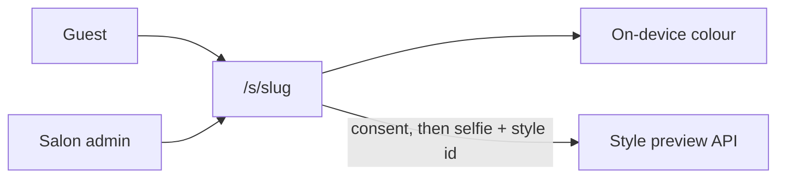
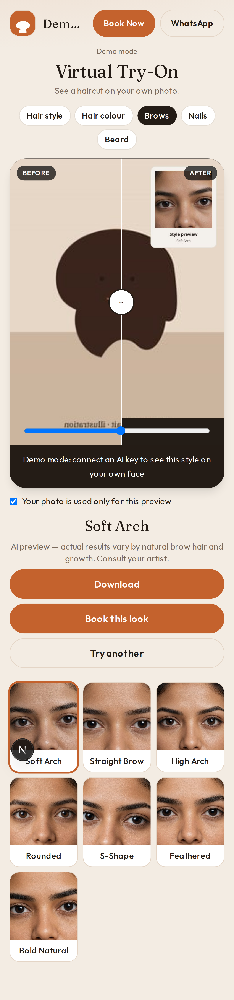
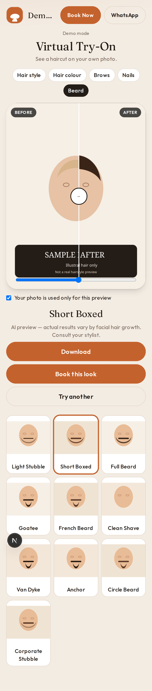
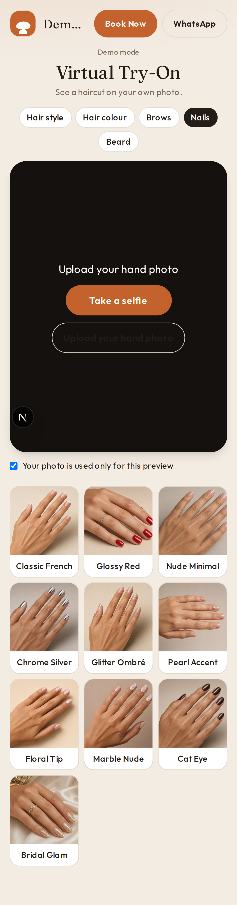
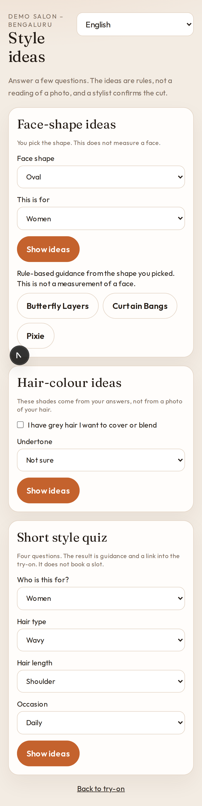
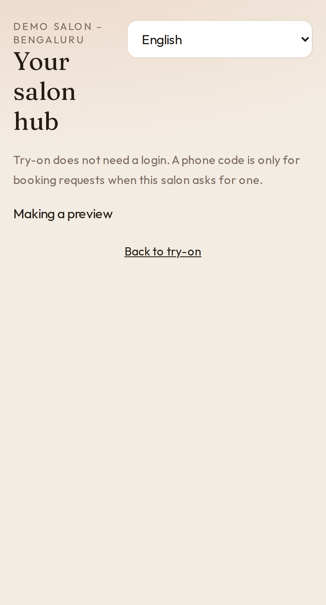
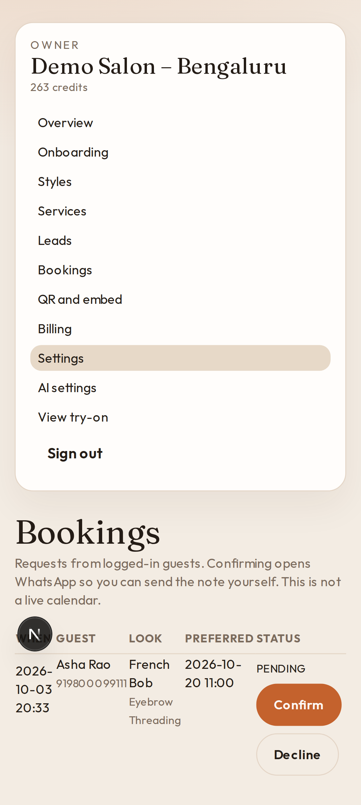

# HelixStac TryOn

White-label virtual hairstyle and hair-colour try-on for small salons. A salon puts a link or a QR in the shop, or pastes one script tag into its website. Guests try a colour on their own phone and can preview a cut. The preview is a guide. Booking opens the salon's WhatsApp and records a lead.

The platform name is configurable with `BRAND_NAME`. The demo salon is **Demo Salon – Bengaluru**.

## Tech stack

- **Next.js 15** (App Router) and **React 19**
- **TypeScript**
- **Tailwind CSS 3**
- **Node.js** route handlers
- **Prisma 6** with **SQLite** for one-command local dev and **PostgreSQL** in Docker (`scripts/prepare-prisma.mjs` switches the provider from `DATABASE_URL`)
- **Zod**
- **Auth.js** (`next-auth` 5, JWT sessions, email + password and magic link)
- **Vitest** and **Playwright**
- **ESLint** (`eslint-config-next`)
- **sharp** for in-memory JPEG re-encode (EXIF stripped, files not saved)
- **qrcode** for PNG and SVG
- **bcryptjs** for password hashes
- **MediaPipe Tasks Vision 0.10.21** `ImageSegmenter` and the hair segmenter model, self-hosted under `public/mediapipe` (Apache-2.0, see `public/mediapipe/NOTICE.md`)
- **@google/genai** for the optional Gemini image adapter
- **Docker** and **docker compose**
- **GitHub Actions** CI

No third-party CDN is required for the colour model. AI and payments default to offline mocks.

## Quickstart

```bash
npm install
cp .env.example .env
npm run db:push
npm run seed
npm run dev
```

Open [http://localhost:3000](http://localhost:3000), then the demo at [http://localhost:3000/s/demo-salon](http://localhost:3000/s/demo-salon).

Docker (Postgres):

```bash
docker compose up --build
```

The container runs `prisma db push` and the seed on startup. The same demo logins work.

### Demo logins

These accounts exist only after seeding a local database. They are not production secrets.

| Role | Email | Password |
|---|---|---|
| Owner | `owner@demo.helixstac.app` | `DemoSalon#2026` |
| Staff | `staff@demo.helixstac.app` | `DemoStaff#2026` |
| Super-admin | `super@helixstac.app` | `SuperAdmin#2026` |

Demo WhatsApp number: `919800011122` (not a live handset).

## Scripts

| Script | What it does |
|---|---|
| `npm run dev` | Next.js dev server |
| `npm run db:push` | Point Prisma at sqlite or postgres, then push the schema |
| `npm run seed` | Demo salon, 59 styles enabled, 16 shades, services |
| `npm run lint` | ESLint |
| `npm run typecheck` | `tsc --noEmit` |
| `npm test` | Vitest |
| `npm run test:e2e` | Playwright smoke against the dev server |
| `npm run build` | Production build |
| `npm run ai:smoke` | Run N styles on local photos in `ai-samples/`. Writes `ai-smoke/out/` and respects the spend cap. |
| `npm run scan:secrets` | Fail if committed files contain API-key patterns |

## Environment

Copy `.env.example` to `.env`. Real keys are optional.

### Where API keys go

Put keys only in `.env` on your machine. That file is gitignored. On a host, put them in the platform's secret or environment settings (Vercel, Railway, or the server's env), not in the repo and not in a screenshot.

`npm run scan:secrets` fails if patterns such as a Google key (`AIza` plus a long token) or an OpenAI key (`sk-` plus a long token) are committed. CI runs the same check. After `npm install`, git uses `.githooks/pre-commit`, which runs it before each commit.

| Variable | Purpose |
|---|---|
| `DATABASE_URL` | `file:./dev.db` (SQLite, path is relative to `prisma/schema.prisma`) or `postgresql://…` |
| `AUTH_SECRET` | Auth.js secret. Change it before any shared deploy. |
| `AUTH_URL` | Public URL of this app |
| `APP_BASE_URL` | Used in QR codes and magic links |
| `ROOT_DOMAIN` | Apex domain. `{slug}.try.{ROOT_DOMAIN}` routes to that salon. |
| `BRAND_NAME` | Platform name. Default `HelixStac TryOn`. |
| `AI_PROVIDER` | `mock` (default), `gemini`, `openai`, `replicate`, or `fal` |
| `GEMINI_API_KEY` | Paid-tier key. Leave empty to stay on the mock. |
| `OPENAI_API_KEY` | OpenAI key for `AI_PROVIDER=openai`. Leave empty to stay on the mock. |
| `OPENAI_IMAGE_MODEL_TEST` | Test tier model. Default `gpt-image-1-mini`. |
| `OPENAI_IMAGE_MODEL_MEDIUM` | Medium tier model. Default `gpt-image-1-mini`. Set `gpt-image-1` to use that model at medium quality. |
| `OPENAI_IMAGE_MODEL_HIGH` | High tier model. Default `gpt-image-1`. |
| `AI_SPEND_CAP_INR` | Hard testing cap for paid image calls. Default `500`. |
| `AI_COST_PER_CALL_INR_{PROVIDER}_{TIER}` | Optional INR override for `TEST`, `MEDIUM`, or `HIGH`. |
| `FX_INR_PER_USD` | Rupees per dollar for the cost ledger. Default `96`. |
| `GEMINI_MODEL_STANDARD` | Test tier. Default `gemini-3.1-flash-lite-image` ($0.0336 / 1K image). |
| `GEMINI_MODEL_MEDIUM` | Medium tier. Default `gemini-3.1-flash-image` ($0.067 / 1K image). |
| `GEMINI_MODEL_HD` | High tier. Default `gemini-3.1-flash-image`. |
| `GEMINI_TEXT_MODEL` | Optional concierge text model, default `gemini-3.1-flash-lite` |
| `CONCIERGE_LLM` | `rules` (default) or `gemini` |
| `REPLICATE_API_TOKEN`, `FAL_KEY` | Optional failover adapters |
| `BILLING_PROVIDER` | `mock` (default) or `razorpay` |
| `RAZORPAY_KEY_ID`, `RAZORPAY_KEY_SECRET`, `RAZORPAY_WEBHOOK_SECRET` | Razorpay |
| `RAZORPAY_PLAN_{PLAN}_{MONTHLY\|YEARLY}` | Plan ids you create in the Razorpay dashboard. Amounts should include 18% GST. |
| `AI_COST_INR_STANDARD`, `AI_COST_INR_HD` | Super-admin COGS assumption. Defaults ₹3.5 and ₹7. |
| `ALLOW_DEV_MAGIC_LINK` | When email is not configured, local dev can show the sign-in link. Keep this off in production. |

`gemini-2.5-flash-image` was shut down on 2 Oct 2026. Do not set it. Model ids above were checked against Google's Gemini docs on 3 Oct 2026: [image generation](https://ai.google.dev/gemini-api/docs/generate-content/image-generation) and [pricing](https://ai.google.dev/gemini-api/docs/pricing).

### Gemini

1. Create a key on the **paid** tier. Google states that paid-tier content is not used to improve its products; free-tier content is.
2. Set `AI_PROVIDER=gemini` and `GEMINI_API_KEY`.
3. Leave the model ids unless you have re-checked the docs.
4. Standard previews use 1 credit. HD uses 2 and the HD model.

### Before you add your API key

The try-on works before any key exists. Demo mode is the default.

Works with no key:

- Guest consent, camera, upload, and on-device live colour
- The style gallery: realistic portraits for Women, Men, and Kids, plus photo cards for brows, beard, and nails
- A result on the guest's own photo, with a labelled Style preview card of the look they picked. Hair, brows, and beard say “on your own face”. Nails say “on your own hand” and ask for a hand photo
- Booking on WhatsApp, the salon admin, and the preview caps

Needs a key (OpenAI or Gemini):

- An after image that is an edit of the guest's face in the selected style
- The prompt for that style, with the guest photo as the only input image
- Test connection on AI settings, and spend counted against `AI_SPEND_CAP_INR`

Add a key in `.env` (`OPENAI_API_KEY` or `GEMINI_API_KEY` plus `AI_PROVIDER`) or paste it on `/super/ai` (platform) or `/admin/ai` (salon owner, when bring-your-own is allowed). The pasted key is encrypted on the server. The page shows a mask, not the key. The style thumbnail is not sent to the provider unless `OPENAI_SEND_STYLE_REFERENCE` or `GEMINI_SEND_STYLE_REFERENCE` is `true`.

With no key, or when the testing spend cap is already used, the guest sees a labelled sample and “Demo mode – connect an AI key for real hairstyle previews”. That sample is not stored as a successful paid preview, and the salon credit is refunded. A provider error, an unknown model, or a timeout is not replaced with that sample and is not sent again. A failed placement check before any provider call is not charged. A provider call our validator later rejects stays on the provider ledger.

### Quality tiers

Guests, calibration, and any new or unproven key use **Test**. Medium is used only after a super-admin runs calibration (every zone placed) and clicks **Approve medium quality**. High is off until a super-admin checks **Enable high quality**, and guests still do not use it unless that tier is selected. The provider is called with the model id from this config. If the provider says the model does not exist, that call is not retried.

Output size is `1024x1024` for every tier. That is the smallest size the OpenAI image edit API accepts. Test also shrinks the input photo to 768px on the long side before it is sent. Gemini image models are requested at their default 1K output. The SDK used here has no separate image-size field on `generateContent`.

Estimates use list price × `FX_INR_PER_USD` (default 96) × 1.08, rounded up to ₹0.1. They are not a provider invoice. When the API returns token usage, the super-admin ledger stores that exact USD cost and the same FX rate with no 1.08 buffer. Otherwise it stores the tier estimate.

Prices checked 3 Oct 2026 against the [gpt-image-1-mini](https://developers.openai.com/api/docs/models/gpt-image-1-mini) and [gpt-image-1](https://developers.openai.com/api/docs/models/gpt-image-1) model pages, and [Gemini pricing](https://ai.google.dev/gemini-api/docs/pricing).

| Tier | When it runs | OpenAI request | Gemini request | Estimate |
|---|---|---|---|---|
| Test | Default. Calibration. New key. Guests until promoted. | `gpt-image-1-mini`, quality `low`, size `1024x1024`, input long side 768 | `gemini-3.1-flash-lite-image` (`GEMINI_MODEL_STANDARD`) | OpenAI ₹0.60 ($0.005). Gemini ₹3.50 ($0.0336). |
| Medium | After **Approve medium quality**. | `gpt-image-1-mini`, quality `medium`, size `1024x1024`. Override with `OPENAI_IMAGE_MODEL_MEDIUM` ( `gpt-image-1` medium is ₹4.40 / $0.042). | `gemini-3.1-flash-image` (`GEMINI_MODEL_MEDIUM`), 1K | OpenAI ₹1.20 ($0.011). Gemini ₹7.00 ($0.067). |
| High | Off until enabled. Guests only if enabled and selected. | `gpt-image-1`, quality `high`, size `1024x1024` | `gemini-3.1-flash-image` (`GEMINI_MODEL_HD`) | OpenAI ₹17.40 ($0.167). Gemini ₹7.00 ($0.067). |

Token rates used when usage is present: gpt-image-1-mini text input $2 / image input $2.50 / image output $8 per 1M tokens. gpt-image-1 text input $5 / image input $10 / image output $40 per 1M. Gemini flash-lite input $0.25, image output $30 per 1M (1120 tokens per 1K image). Gemini flash image input $0.50, image output $60 per 1M.

`/super/ai` shows the model, quality, size, and INR estimate next to each tier. The calibration result card shows the same, plus the rupees charged for that image and a total. The cost panel on that page (super-admin only) shows the last image, session / day / month totals against `AI_SPEND_CAP_INR`, average cost by tool and tier, the last 50 calls, and projected monthly cost (`average × images per month`) beside Starter ₹799, Pro ₹1999, and Chain ₹4999.

Salon owner pages and the guest try-on do not receive model ids, provider cost, or those totals.

### OpenAI

1. Set `AI_PROVIDER=openai` and `OPENAI_API_KEY` in `.env` or the host secret store.
2. Leave the tier model ids unless you have re-checked the docs. Pasting a new key on `/super/ai` returns the tier to Test.
3. The photo is sent once, in memory, to `POST /v1/images/edits`. It is not written to the database.

### Spend cap

`AI_SPEND_CAP_INR` defaults to 500. Each paid attempt adds the tier estimate (`AI_COST_PER_CALL_INR_{PROVIDER}_{TIER}` when set, otherwise the table above) to `AiCall`. A failed placement check before any provider call is ₹0. A provider call that was billed, including one our validator later rejected, stays inside the cap. A timeout or any other unknown bill is recorded as `UNCERTAIN` and also stays inside the cap. A customer credit refund does not remove that provider row. When the response includes token usage, the ledger stores that USD cost at `FX_INR_PER_USD` with no 1.08 buffer (`costSource=usage`). The cap itself still uses the reserved estimate. The next paid call after the cap returns a labelled sample for guests, and that sample is stored as `DEMO`, not as a successful paid preview. `npm run ai:smoke` uses the same guard. Cost figures are shown only on `/super/ai`.

### What the offline tests prove

Before a paid edit, the server finds the face from the skin region and places the mask with facial proportions (one upright face, not a profile, large enough to place). This is not a neural face mesh, and it is not a claim about how a real model blends:

- Hair and colour: the hair-coloured pixels, plus a margin that depends on the cut. A longer style may extend a little below the current ends. A shorter style stays on the hair that is already there, so that hair can be removed, and does not include the empty background. Eyes, brows, forehead skin, the nose, and the lips are cut out. Plain background and a shirt outside that margin stay out. The MediaPipe hair-segmenter weights are not in this repo, so this is a colour check, not that model.
- Brows: the brow band, above the eyes
- Beard: the jaw and chin below the nose, with the mouth left out
- Nails: fingertip regions on a hand photo. A picture that looks like a face is refused

OpenAI receives that mask on the image edit. Transparent mask pixels are the editable area. Opaque pixels must stay. `input_fidelity=high` is sent only for models that list it (`gpt-image-1` and `gpt-image-1.5`). `gpt-image-1-mini` and `gpt-image-2` do not receive that parameter. An unknown model id is refused before the request. A paid edit is not retried. Gemini does not take a mask; the same server-side composite still runs. The hair prompt tells the model to keep the head, face, and framing the same size and position, not to zoom or re-frame, to change only hair inside the mask, and to remove original hair inside the mask that falls outside the new style (long hair becoming a bob).

Photos are not stretched to the square the image model returns. The photo and the mask are padded onto a centered square with a neutral edge fill (mask bars are opaque, so they are not editable). The result is cropped back to the original aspect before it is composited. The same pad and crop is used for every tool.

Before that composite, a hair or colour result is compared with the original face. The face scale must stay within 5 percent and the face must not have moved, or, if the scale is between 0.8 and 1.25, the frame is warped back into place. The brows, eyes, and nose are compared on that provider frame. If they differ, or the re-frame is larger than that, the edit is rejected. The guest sees “Try another photo.” The provider cost stays on the ledger as billed but failed, it still counts toward the spend cap, and the provider is not called again. The composite is not returned.

Set `DEBUG_SAVE_RAW=true` to write the provider JPEG, after square restore and before the face composite, under `var/ai-debug/`. That folder is gitignored and is not served. It is for local diagnosis of a failed paid edit. That file is not the untouched provider body. The benchmark page stores the decoded provider body separately.

## Reference benchmark (super-admin, not for guests)

This path is separate from guest production. It sends the sanitized selfie first and `public/styles/{styleId}.jpg` second. It does not send a mask, does not paste the original face back, and does not fall back to Gemini, a mock, or another model. Guests stay on the production tiers.

Default request. Output token counts and per-token rates were checked 4 Oct 2026 at [GPT Image 1.5](https://developers.openai.com/api/docs/models/gpt-image-1.5) and the [image generation guide](https://developers.openai.com/api/docs/guides/image-generation). The quote also adds image-input tokens, scaled from the first paid run (10,885 image tokens for a 1536×1024 canvas plus a 512 reference) with a 15% margin, plus a 400-token text allowance. A 1536×1024 medium quote is about ₹17 buffered. The actual bill is whatever usage the provider returns. These are not invoices.

- `POST https://api.openai.com/v1/images/edits`
- model `gpt-image-1.5` (`BENCHMARK_MODEL`)
- quality `medium` (`BENCHMARK_QUALITY`)
- `input_fidelity=high` (the image guide says to omit this only for `gpt-image-2`; `gpt-image-1.5` is sent `high`, and a rejection fails the run with no fallback)
- `output_format=png`
- `n=1`
- size `1024x1024`, `1536x1024`, or `1024x1536`, chosen from the selfie aspect
- one call, no retry
- hard run cap `BENCHMARK_RUN_CAP_INR` (default 30) on the full estimate, including input tokens
- `BENCHMARK_INPUT_SIZE=1024` is off by default. It sends the selfie on a 1024 edge (square, or 1024×1536 for a tall photo) so a super-admin can compare cost. A wide selfie gains side bars and a smaller subject. The reference stays at its native 512.

The 59 catalogue references are 512×512 synthetic portraits. No larger file is in the repo, so the 512px JPEG is what gets sent. Do not commit customer selfies. Put the three review photos only on the machine that runs the test.

Quote without a provider call:

```bash
npm run benchmark:quote
```

Paid run: sign in as the super-admin, open `/super/ai`, choose any hairstyle and one selfie from your computer, read the estimate and its breakdown, tick the confirmation, and press **Run benchmark**. Open `/super/ai/benchmark/{id}`. The page shows the sanitized selfie beside `provider-response.png`, labelled UNVALIDATED, plus usage, latency, the estimate, and the actual cost from provider usage. **Delete now** removes that run's photos. Stages older than `BENCHMARK_RETENTION_HOURS` (default 72) are deleted on the next benchmark request. They are never served to guests. Family photos are personal data and are sent only to OpenAI.

Score six runs (three selfies, two styles, including at least one long-to-short) in `docs/benchmark-score-sheet.csv`. Columns: likeness, style match, framing, edges, reconstruction, latency, token usage, output estimate, usage INR if the ledger has it, and whether you accept the frame. Do not treat a passing alignment, or this offline test suite, as a haircut score.

The unit suite proves this without a provider key:

- A mock edit that paints the whole frame one colour leaves every pixel outside the mask byte-for-byte identical to the original
- Eyes, forehead, nose, and mouth stay out of the hair and colour zones on landscape, portrait, small, and tilted fixtures
- Long hair past the shoulders is inside the zone and a shirt in the same frame is not
- Padding to a square and cropping back reproduces the original pixels exactly
- OpenAI mask alpha is 0 on editable hair and 255 on the face
- Masks sit in the expected zone on frontal, off-centre, mirrored, EXIF-rotated, wide, and camera-shaped fixtures
- No face, two faces, a tilt, a side profile, a tiny face, and a hand sent to the beard tool are rejected before the edit function is called
- A hair edit that changes the eyes, or that zooms the face past the alignment window, is rejected once and is not retried
- A modest zoom is warped back onto the original face and can then be composited
- `npm run replay:raw -- raw.jpg original.jpg long-layers` runs that check on a saved provider JPEG with no network call
- A provider error is not tried again. An unknown model id is not tried again. A placement failure is not tried again and does not keep the rupee charge when the provider was never called. A billed post-check or face-guard failure stays billed and still counts against the cap. A timeout stays as an uncertain bill and is not regenerated
- Calibration stops at 5 images or about ₹30, whichever comes first

`npm run calibrate` writes before / mask / after files under `docs/mask-overlays/` using the flat-colour edit. The same action is the **Calibration run** button on `/super/ai`. With no key it spends ₹0. With a key it uses the real model inside that cap.

These tests do **not** prove that a real model blends hair, brows, beard, or polish convincingly. That still has to be judged by looking at a paid calibration result. The offline proof is the lock, the placement checks, and the spend cap.

### Smoke a provider locally

Put your own JPEG, PNG, or WebP files in `ai-samples/` (gitignored). Then:

```bash
npm run ai:smoke
npm run ai:smoke -- ai-samples 2
```

The second form runs 2 styles per photo. Outputs land in `ai-smoke/out/`, which is gitignored. The script prints the estimated cost and stops charging once the cap is hit.

### Razorpay

1. Set `BILLING_PROVIDER=razorpay` and the three secrets.
2. Create subscription plans in Razorpay for Starter, Pro, and Chain, monthly and yearly. Put the plan ids in `RAZORPAY_PLAN_STARTER_MONTHLY` and the matching variables.
3. Point a webhook at `/api/webhooks/razorpay` for `subscription.charged`, `subscription.halted`, and `payment.captured`. The route checks `X-Razorpay-Signature`.
4. With `BILLING_PROVIDER=mock`, choosing a plan or a pack in the admin writes the invoice and the credits immediately. Use that for demos.

## White-label a salon in about 10 minutes

1. Sign in as an owner (or create the salon row — the seed is the reference).
2. `/admin/onboarding`: name, brand colour, confirm services, WhatsApp, languages.
3. `/admin/services`: prices in INR.
4. `/admin/styles`: turn styles and shades on or off. Starter keeps 25 styles.
5. `/admin/qr`: download PNG or SVG, print the standee at `/s/{slug}/qr`.
6. On Pro or Chain, paste the embed script from that page into the salon website.

Guest URL: `https://{APP_BASE_URL}/s/{slug}` or `{slug}.try.{ROOT_DOMAIN}` once DNS is pointed here. Custom domains are saved under Settings; verification looks for a TXT record.

## Embed

```html
<script src="https://your-domain/embed.js" data-salon="demo-salon" data-lang="kn" defer></script>
```

The script adds a button and an iframe to `/embed/{slug}` with `allow="camera"`. The iframe posts `{ type: "tryon:booked", look }` to the parent. The message does not include a photo.

## Deploy

- **Vercel:** Next.js app, `DATABASE_URL` on Neon or another Postgres, `AUTH_SECRET`, and the provider flags. Set the function timeout with `maxDuration` in mind: AI calls can take 10–20 seconds. Do not enable the dev magic link.
- **Railway:** same env, Postgres plugin, start command `npm run start` after `prisma db push` and seed on a release phase.
- **VPS:** `docker compose up --build` on a machine with Postgres. Put Caddy or another proxy in front for TLS. Wildcard `*.try.yourdomain` should reach the app so middleware can read the host.

Back up the database. There is no image bucket to back up.

## Product map



More detail is in [docs/ARCHITECTURE.md](docs/ARCHITECTURE.md).

## Guest try-on

`/` opens the demo salon try-on. The salon page is one screen. There is no consent wall, no wizard, and no login.

1. Header: salon logo and name, **Book Now**, and **WhatsApp**. Title: **Virtual Try-On**.
2. The photo frame has **Take a selfie** and **Upload photo**. One line sits under it: “Your photo is used only for this preview”, with a checkbox. The full notice stays on `/privacy`.
3. The Women / Men grid (Kids when the salon enables it) is on the page before a photo. Every enabled style for that gender is shown, with the portrait in `public/styles`. Tapping a style before a photo scrolls up and says **Add your photo first**, and the style stays selected.
4. After a photo, the frame shows it with **Retake** and the line “Now pick a style below - it takes about 10 seconds.” A style runs in the same frame (**Styling your look...**), then a before/after slider, **Download**, **Book this look** (WhatsApp), and **Try another** (scrolls back to the grid).
5. **Hair colour**, **Brows**, **Nails**, and **Beard** are chips under the title. They swap the grid on the same page. A chip the salon turns off is hidden.
6. With no AI key, a small **Demo mode** note is on the page. The result is still the guest photo plus a labelled Style preview card.
7. Anonymous guests get a daily AI preview cap (default 8). A **salon-mode** link from the admin QR page is unlimited. The phone hub at `/s/{slug}/me` is still there for a booking request; the try-on itself does not send guests to log in.

## Reference parity

The full checklist is [docs/PARITY.md](docs/PARITY.md). Short version:

| Reference flow | In this app |
|---|---|
| Colour / style mirror, shutter, shades, style gallery, before/after, book | Yes, on one page. The full portrait grid is visible before a photo. |
| Eyebrow mapping | Yes. Seven original shapes. The reference lists eight names; we did not copy that set. |
| Nail try-on | Yes. Ten original designs. Rear camera on an empty stage. |
| Beard AI try-on | Ours. The reference has beard services, not an AI beard preview. |
| Kids style previews | Yes, on the Kids tab. The reference does not preview kids' cuts. |
| Face, colour, and style quiz | Yes, as labelled rule-based guidance with deep links. Not a photo measurement. |
| Try-on without login, daily cap, salon-mode token | Yes. Caps are our settings (the reference numbers were not public). |
| Customer hub and booking request | Yes, phone OTP, optional until the salon requires it for booking. |
| Wallet, loyalty, referrals, creator circle | Roadmap only. Not in this build. |

A demo-only **Use sample portrait** link is under the empty stage for machines with no camera.

## Screenshots

Taken from the mock-mode demo in a phone-sized browser. The camera shot uses Chromium's fake camera.















## Docs

- [Architecture](docs/ARCHITECTURE.md)
- [Business plan](docs/BUSINESS_PLAN.md)
- [Privacy](docs/PRIVACY.md)
- [Roadmap](docs/ROADMAP.md)
- [Feature parity](docs/PARITY.md)
- [Sales kit](docs/SALES_KIT.md)

## Limits, said plainly

- Live colour is a flat tint. It does not show highlights, balayage, or how light lifts dark hair.
- Style previews can drift. The UI calls them a guide. There is no measured accuracy number.
- Face-shape suggestions are rules on catalogue tags, not a measurement.
- The concierge answers from the salon's menu unless you opt into a text model.
- Rate limits are in-process. More than one server needs a shared store.
- The Razorpay adapter is real HTTP, and it stays idle until keys and plan ids exist.
- Kids' styles rely on the adult ticking the age line. That is not an identity check.
