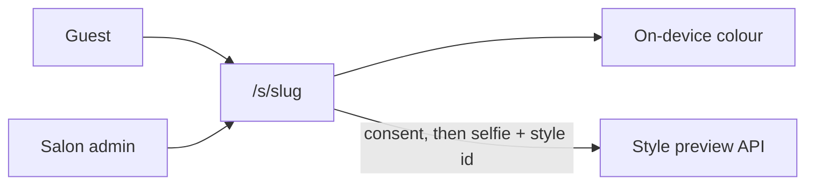

# HelixStac TryOn

White-label virtual hairstyle and hair-colour try-on for small salons. A salon puts a link or a QR in the shop, or pastes one script tag into its website. Guests try a colour on their own phone and can preview a cut. The preview is a guide. Booking opens the salon's WhatsApp and records a lead.

The platform name is configurable with `BRAND_NAME`. The demo salon is **Demo Salon – Bengaluru**.

## Tech stack

- **Next.js 15** (App Router) and **React 19**
- **TypeScript**
- **Tailwind CSS 3**
- **Node.js** route handlers
- **Prisma 6** with **SQLite** for one-command local dev and **PostgreSQL** in Docker (`scripts/prepare-prisma.mjs` switches the provider from `DATABASE_URL`)
- **Zod**
- **Auth.js** (`next-auth` 5, JWT sessions, email + password and magic link)
- **Vitest** and **Playwright**
- **ESLint** (`eslint-config-next`)
- **sharp** for in-memory JPEG re-encode (EXIF stripped, files not saved)
- **qrcode** for PNG and SVG
- **bcryptjs** for password hashes
- **MediaPipe Tasks Vision 0.10.21** `ImageSegmenter` and the hair segmenter model, self-hosted under `public/mediapipe` (Apache-2.0, see `public/mediapipe/NOTICE.md`)
- **@google/genai** for the optional Gemini image adapter
- **Docker** and **docker compose**
- **GitHub Actions** CI

No third-party CDN is required for the colour model. AI and payments default to offline mocks.

## Quickstart

```bash
npm install
cp .env.example .env
npm run db:push
npm run seed
npm run dev
```

Open [http://localhost:3000](http://localhost:3000), then the demo at [http://localhost:3000/s/demo-salon](http://localhost:3000/s/demo-salon).

Docker (Postgres):

```bash
docker compose up --build
```

The container runs `prisma db push` and the seed on startup. The same demo logins work.

### Demo logins

These accounts exist only after seeding a local database. They are not production secrets.

| Role | Email | Password |
|---|---|---|
| Owner | `owner@demo.helixstac.app` | `DemoSalon#2026` |
| Staff | `staff@demo.helixstac.app` | `DemoStaff#2026` |
| Super-admin | `super@helixstac.app` | `SuperAdmin#2026` |

Demo WhatsApp number: `919800011122` (not a live handset).

## Scripts

| Script | What it does |
|---|---|
| `npm run dev` | Next.js dev server |
| `npm run db:push` | Point Prisma at sqlite or postgres, then push the schema |
| `npm run seed` | Demo salon, 59 styles enabled, 16 shades, services |
| `npm run lint` | ESLint |
| `npm run typecheck` | `tsc --noEmit` |
| `npm test` | Vitest |
| `npm run test:e2e` | Playwright smoke against the dev server |
| `npm run build` | Production build |
| `npm run ai:smoke` | Run N styles on local photos in `ai-samples/`. Writes `ai-smoke/out/` and respects the spend cap. |
| `npm run scan:secrets` | Fail if committed files contain API-key patterns |

## Environment

Copy `.env.example` to `.env`. Real keys are optional.

### Where API keys go

Put keys only in `.env` on your machine. That file is gitignored. On a host, put them in the platform's secret or environment settings (Vercel, Railway, or the server's env), not in the repo and not in a screenshot.

`npm run scan:secrets` fails if patterns such as a Google key (`AIza` plus a long token) or an OpenAI key (`sk-` plus a long token) are committed. CI runs the same check. After `npm install`, git uses `.githooks/pre-commit`, which runs it before each commit.

| Variable | Purpose |
|---|---|
| `DATABASE_URL` | `file:./dev.db` (SQLite, path is relative to `prisma/schema.prisma`) or `postgresql://…` |
| `AUTH_SECRET` | Auth.js secret. Change it before any shared deploy. |
| `AUTH_URL` | Public URL of this app |
| `APP_BASE_URL` | Used in QR codes and magic links |
| `ROOT_DOMAIN` | Apex domain. `{slug}.try.{ROOT_DOMAIN}` routes to that salon. |
| `BRAND_NAME` | Platform name. Default `HelixStac TryOn`. |
| `AI_PROVIDER` | `mock` (default), `gemini`, `openai`, `replicate`, or `fal` |
| `GEMINI_API_KEY` | Paid-tier key. Leave empty to stay on the mock. |
| `OPENAI_API_KEY` | OpenAI key for `AI_PROVIDER=openai`. Leave empty to stay on the mock. |
| `OPENAI_IMAGE_MODEL` | gpt-image model id. Default `gpt-image-1`. |
| `OPENAI_IMAGE_QUALITY` | `low`, `medium`, or `high` for a standard preview. Default `medium`. |
| `OPENAI_IMAGE_QUALITY_HD` | Quality when the guest picks HD. Default `high`. |
| `AI_SPEND_CAP_INR` | Hard testing cap for paid image calls. Default `500`. |
| `AI_COST_PER_CALL_INR_{PROVIDER}_{QUALITY}` | Estimated rupees for one call, for example `AI_COST_PER_CALL_INR_OPENAI_MEDIUM`. |
| `GEMINI_MODEL_STANDARD` | Default `gemini-3.1-flash-lite-image` (~$0.0336 / 1K image) |
| `GEMINI_MODEL_HD` | Default `gemini-3.1-flash-image` (~$0.067 / 1K image) |
| `GEMINI_TEXT_MODEL` | Optional concierge text model, default `gemini-3.1-flash-lite` |
| `CONCIERGE_LLM` | `rules` (default) or `gemini` |
| `REPLICATE_API_TOKEN`, `FAL_KEY` | Optional failover adapters |
| `BILLING_PROVIDER` | `mock` (default) or `razorpay` |
| `RAZORPAY_KEY_ID`, `RAZORPAY_KEY_SECRET`, `RAZORPAY_WEBHOOK_SECRET` | Razorpay |
| `RAZORPAY_PLAN_{PLAN}_{MONTHLY\|YEARLY}` | Plan ids you create in the Razorpay dashboard. Amounts should include 18% GST. |
| `AI_COST_INR_STANDARD`, `AI_COST_INR_HD` | Super-admin COGS assumption. Defaults ₹3.5 and ₹7. |
| `ALLOW_DEV_MAGIC_LINK` | When email is not configured, local dev can show the sign-in link. Keep this off in production. |

`gemini-2.5-flash-image` was shut down on 2 Oct 2026. Do not set it. Model ids above were checked against Google's Gemini docs on 3 Oct 2026: [image generation](https://ai.google.dev/gemini-api/docs/generate-content/image-generation) and [pricing](https://ai.google.dev/gemini-api/docs/pricing).

### Gemini

1. Create a key on the **paid** tier. Google states that paid-tier content is not used to improve its products; free-tier content is.
2. Set `AI_PROVIDER=gemini` and `GEMINI_API_KEY`.
3. Leave the model ids unless you have re-checked the docs.
4. Standard previews use 1 credit. HD uses 2 and the HD model.

### Before you add your API key

The try-on works before any key exists. Demo mode is the default.

Works with no key:

- Guest consent, camera, upload, and on-device live colour
- The style gallery: realistic portraits for Women, Men, and Kids
- A style result on the guest's own photo, with a labelled Style preview card of the look they picked and the banner “Demo mode: connect an AI key to see this style on your own face”
- Booking on WhatsApp, the salon admin, and the preview caps

Needs a key (OpenAI or Gemini):

- An after image that is an edit of the guest's face in the selected style
- The prompt for that style, with the guest photo as the only input image
- Test connection on AI settings, and spend counted against `AI_SPEND_CAP_INR`

Add a key in `.env` (`OPENAI_API_KEY` or `GEMINI_API_KEY` plus `AI_PROVIDER`) or paste it on `/super/ai` (platform) or `/admin/ai` (salon owner, when bring-your-own is allowed). The pasted key is encrypted on the server. The page shows a mask, not the key. The style thumbnail is not sent to the provider unless `OPENAI_SEND_STYLE_REFERENCE` or `GEMINI_SEND_STYLE_REFERENCE` is `true`.

If a paid call fails, or the testing spend cap is already used, the app returns the same demo composite so the salon page does not die. With no key, the try-on also shows: “Demo mode – connect an AI key for real hairstyle previews”.

### OpenAI

1. Set `AI_PROVIDER=openai` and `OPENAI_API_KEY` in `.env` or the host secret store.
2. `OPENAI_IMAGE_MODEL` is the gpt-image model id. `OPENAI_IMAGE_QUALITY` is `low`, `medium`, or `high` for a standard preview. HD uses `OPENAI_IMAGE_QUALITY_HD`.
3. The photo is sent once, in memory, to `POST /v1/images/edits`. It is not written to the database.

### Spend cap

`AI_SPEND_CAP_INR` defaults to 500. Each paid attempt adds `AI_COST_PER_CALL_INR_{PROVIDER}_{QUALITY}` (an estimate, not a provider invoice) to `AiCall`. The super-admin page shows the total against the cap. The next paid call after the cap returns the labelled sample and a short explanation. `npm run ai:smoke` uses the same guard.

### Smoke a provider locally

Put your own JPEG, PNG, or WebP files in `ai-samples/` (gitignored). Then:

```bash
npm run ai:smoke
npm run ai:smoke -- ai-samples 2
```

The second form runs 2 styles per photo. Outputs land in `ai-smoke/out/`, which is gitignored. The script prints the estimated cost and stops charging once the cap is hit.

### Razorpay

1. Set `BILLING_PROVIDER=razorpay` and the three secrets.
2. Create subscription plans in Razorpay for Starter, Pro, and Chain, monthly and yearly. Put the plan ids in `RAZORPAY_PLAN_STARTER_MONTHLY` and the matching variables.
3. Point a webhook at `/api/webhooks/razorpay` for `subscription.charged`, `subscription.halted`, and `payment.captured`. The route checks `X-Razorpay-Signature`.
4. With `BILLING_PROVIDER=mock`, choosing a plan or a pack in the admin writes the invoice and the credits immediately. Use that for demos.

## White-label a salon in about 10 minutes

1. Sign in as an owner (or create the salon row — the seed is the reference).
2. `/admin/onboarding`: name, brand colour, confirm services, WhatsApp, languages.
3. `/admin/services`: prices in INR.
4. `/admin/styles`: turn styles and shades on or off. Starter keeps 25 styles.
5. `/admin/qr`: download PNG or SVG, print the standee at `/s/{slug}/qr`.
6. On Pro or Chain, paste the embed script from that page into the salon website.

Guest URL: `https://{APP_BASE_URL}/s/{slug}` or `{slug}.try.{ROOT_DOMAIN}` once DNS is pointed here. Custom domains are saved under Settings; verification looks for a TXT record.

## Embed

```html
<script src="https://your-domain/embed.js" data-salon="demo-salon" data-lang="kn" defer></script>
```

The script adds a button and an iframe to `/embed/{slug}` with `allow="camera"`. The iframe posts `{ type: "tryon:booked", look }` to the parent. The message does not include a photo.

## Deploy

- **Vercel:** Next.js app, `DATABASE_URL` on Neon or another Postgres, `AUTH_SECRET`, and the provider flags. Set the function timeout with `maxDuration` in mind: AI calls can take 10–20 seconds. Do not enable the dev magic link.
- **Railway:** same env, Postgres plugin, start command `npm run start` after `prisma db push` and seed on a release phase.
- **VPS:** `docker compose up --build` on a machine with Postgres. Put Caddy or another proxy in front for TLS. Wildcard `*.try.yourdomain` should reach the app so middleware can read the host.

Back up the database. There is no image bucket to back up.

## Product map



More detail is in [docs/ARCHITECTURE.md](docs/ARCHITECTURE.md).

## Guest try-on

After the consent notice, the salon page is a phone-sized mirror.

1. A tool switcher sits under the hero: **COLOUR**, **STYLE**, **BROWS**, **BEARD**, and **NAILS**. Each one can be turned off in Settings. Try-on does not ask for a login.
2. The dark stage asks for the front camera or an upload. **START CAMERA** opens the live mirror, with a round shutter and a small **Photo** upload. If the camera is blocked, the same stage keeps the upload path.
3. Colour swatches (the 16 named shades) sit on the live feed and on a still photo. Live colour stays on the device.
4. After a shutter tap or an upload, **STYLE** opens the Women / Men / Kids gallery. Illustrated thumbnails are original placeholders. Choosing a style runs the preview (about 10 seconds on a paid model; the demo mock is faster) and then a draggable **BEFORE / AFTER** slider.
5. **BOOK THIS LOOK** opens the salon's WhatsApp with the look and mapped services, and records a lead. **DOWNLOAD** saves the after image in the browser. **TRY ANOTHER STYLE** returns to the gallery and keeps the same photo. Up to four looks stay in the compare strip.
6. **BROWS** uses the same photo. The guest picks a shape (Soft Arch, Straight Brow, High Arch, Rounded, S-Shape, Feathered, Bold Natural). The preview spends a credit, keeps identity and skin unchanged in the prompt, and ends with **BOOK THIS**, **DOWNLOAD**, and **TRY ANOTHER SHAPE**. Booking maps Eyebrow Threading and Eyebrow Shaping.
7. **BEARD** is men's facial hair (stubble, short boxed, full, goatee, French, clean shave, and four more). **NAILS** is ten original designs and prefers the rear camera for a hand photo. Kids' cuts stay on the Style gallery's Kids tab. **Style ideas** (`/s/{slug}/guide`) is a short rule-based quiz plus face-shape and colour questions. It links into the try-on with a style or shade preselected and does not spend a credit by itself.
8. Anonymous guests get a daily AI preview cap (default 8, owner-configurable). A logged-in guest gets a higher cap (default 30). A **salon-mode** link from the admin QR page is unlimited for the chair and is not printed on the public standee. Live colour does not count.
9. **Book** opens WhatsApp and records a lead, unless the owner turns on "require a phone login". Then Book goes to `/s/{slug}/me`: mobile number, 4–6 digit code (mock OTP in dev), a 13+ profile, and a booking request the salon confirms from the Bookings inbox. Wallet, loyalty, and referrals are not built.

## Reference parity

The full checklist is [docs/PARITY.md](docs/PARITY.md). Short version:

| Reference flow | In this app |
|---|---|
| Colour / style mirror, shutter, shades, style gallery, before/after, book | Yes, after the consent step. Thumbnails are original illustrations. |
| Eyebrow mapping | Yes. Seven original shapes. The reference lists eight names; we did not copy that set. |
| Nail try-on | Yes. Ten original designs. Rear camera on an empty stage. |
| Beard AI try-on | Ours. The reference has beard services, not an AI beard preview. |
| Kids style previews | Yes, on the Kids tab. The reference does not preview kids' cuts. |
| Face, colour, and style quiz | Yes, as labelled rule-based guidance with deep links. Not a photo measurement. |
| Try-on without login, daily cap, salon-mode token | Yes. Caps are our settings (the reference numbers were not public). |
| Customer hub and booking request | Yes, phone OTP, optional until the salon requires it for booking. |
| Wallet, loyalty, referrals, creator circle | Roadmap only. Not in this build. |

A demo-only **Use sample portrait** link is under the empty stage for machines with no camera.

## Screenshots

Taken from the mock-mode demo in a phone-sized browser. The camera shot uses Chromium's fake camera.


## Docs

- [Architecture](docs/ARCHITECTURE.md)
- [Business plan](docs/BUSINESS_PLAN.md)
- [Privacy](docs/PRIVACY.md)
- [Roadmap](docs/ROADMAP.md)
- [Feature parity](docs/PARITY.md)
- [Sales kit](docs/SALES_KIT.md)

## Limits, said plainly

- Live colour is a flat tint. It does not show highlights, balayage, or how light lifts dark hair.
- Style previews can drift. The UI calls them a guide. There is no measured accuracy number.
- Face-shape suggestions are rules on catalogue tags, not a measurement.
- The concierge answers from the salon's menu unless you opt into a text model.
- Rate limits are in-process. More than one server needs a shared store.
- The Razorpay adapter is real HTTP, and it stays idle until keys and plan ids exist.
- Kids' styles rely on the adult ticking the age line. That is not an identity check.
