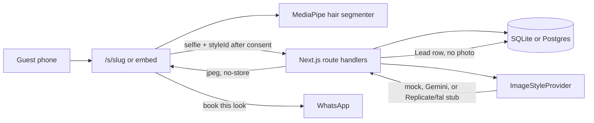

# Architecture

HelixStac TryOn is a multi-tenant Next.js app. A salon gets a branded page, a QR standee, and (on Pro and Chain) a one-line embed. Guests recolour hair on their own phone and can request an AI hairstyle or eyebrow preview that spends the salon's credits. A salon turns Colour, Style, and Brows on or off. Nail art is a disabled slot.

## Tenancy

A salon is a `Tenant`: slug, name, logo, colours, languages, WhatsApp, address, plan, status, credit balance. Public pages live at `/s/[slug]`.

`src/middleware.ts` reads the `Host` header:

- `localhost`, the root domain, `www`, and `app` stay on the platform.
- `{slug}.localhost` and `{slug}.try.{ROOT_DOMAIN}` rewrite to `/s/{slug}`.
- Any other host rewrites to `/s/by-host`, and the page looks up a verified `Domain` row.

Reserved slugs (`admin`, `api`, `embed`, …) are not treated as salons.

## Customer flow

1. Consent is a standalone notice: purpose, on-device colour, transient style processing, no photo storage, deletion, withdrawal, and an age line. `ConsentLog` stores the decision, session id, language, text version, and hash. It does not store the photo.
2. Camera (`getUserMedia`) or an upload. The browser redraws uploads onto a canvas, which drops EXIF. The server runs the bytes through `sharp` again, checks magic bytes and size (2 MB), and re-encodes JPEG.
3. Live colour uses MediaPipe Tasks `ImageSegmenter` with `hair_segmenter.tflite` (category 1 = hair). WASM and the model are served from `/public/mediapipe`. The canvas composites three passes: `color` at 0.85, `soft-light` at 0.55, and `screen` at the shade's lift. This does not upload.
4. Style preview sends `photo`, `styleId`, `quality`, `consentId`, and `sessionId`. The prompt stays in `src/data/styles.ts` on the server. Credits are reserved, then committed or refunded. The JPEG response is `Cache-Control: no-store`.
5. The guest can compare up to four looks kept in tab memory, then Book. That writes a `Lead` and opens `wa.me` with the look, colour, and services mapped from the style.

## Providers

`ImageStyleProvider.generate({ image, styleId, gender, colour, tenantId, quality })`.

| Adapter | When |
|---|---|
| `MockProvider` | Default. No key. Tints the photo and stamps DEMO. |
| `GeminiProvider` | `AI_PROVIDER=gemini` and `GEMINI_API_KEY`. Standard model `gemini-3.1-flash-lite-image`, HD `gemini-3.1-flash-image`. Both env-overridable. Paid tier only. |
| `ReplicateStubProvider` | `replicate` or `fal` plus a token. Posts to that vendor's HTTP API. Inactive without a key. |

If Gemini or the stub throws, the router falls back to the mock and labels the provider `mock:failover-from-…`.

`BillingProvider` is `mock` (grants the plan or pack immediately and writes an invoice) or `razorpay` (subscriptions, orders, webhook HMAC). Prices are stored ex-GST. Invoices add 18%.

## Credits and limits

Balance lives on the tenant. A generation does `RESERVE` (decrement), then `COMMIT` (zero-delta audit) or `REFUND`. Reserves older than five minutes without a settlement are refunded on the next attempt. Standard costs 1 credit, HD costs 2. Live colour costs 0. There is a per-tenant daily cap and in-memory per-IP / per-tenant rate limits. At zero credits the API returns a plain message; colour still works.

## What is stored

`TryOn` and `UsageEvent` store ids, style, quality, status, latency, and an assumed cost. They have no image columns. Logs pass through `redact()`, which drops photo-like fields and long strings.

## Auth

Auth.js (next-auth v5) credentials: email + password, plus a magic-link provider. Sessions are JWTs. Roles are `OWNER` and `STAFF`. `User.isSuperAdmin` opens `/super`.

## i18n

`src/data/i18n.ts` is a dictionary for English, Hindi, Kannada, Tamil, Telugu, and Marathi. The customer try-on uses it. Admin stays in English.
